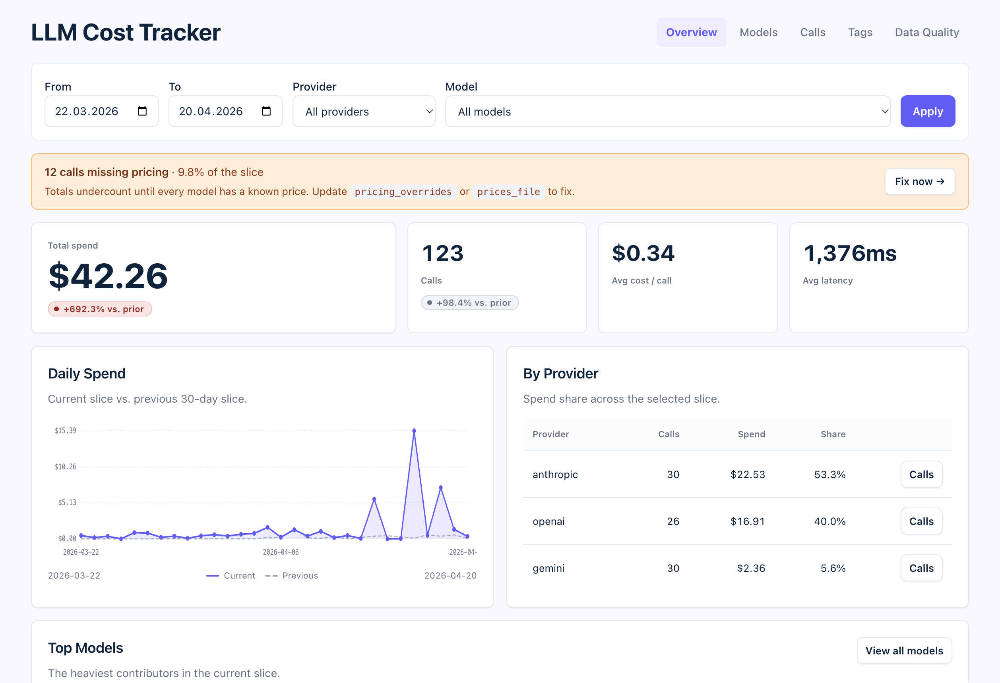

# LLM Cost Tracker

**Self-hosted LLM cost tracking for Ruby and Rails.** Instruments common Ruby SDKs, intercepts Faraday LLM responses, prices events locally, and can store them in your database. No proxy, no SaaS.

[](https://rubygems.org/gems/llm_cost_tracker)
[](https://github.com/sergey-homenko/llm_cost_tracker/actions)
[](https://codecov.io/gh/sergey-homenko/llm_cost_tracker)

Requires Ruby 3.3+, ActiveSupport 7.1+, and Faraday 2.0+.
ActiveRecord storage requires ActiveRecord 7.1+. The mounted dashboard requires Rails 7.1+.

## Why

Every Rails app with LLM integrations eventually runs into the same question: where did that invoice come from? Full observability platforms like Langfuse and Helicone solve a broader set of problems; sometimes you just need a small Rails-native ledger in your own database.

## What You Get

- A local ActiveRecord ledger of provider, model, usage breakdown, cost, latency, tags, streaming usage, and provider response IDs
- Optional official OpenAI and Anthropic SDK integrations, plus automatic Faraday middleware
- Explicit `track` / `track_stream` helpers as a fallback for unsupported clients
- Server-rendered Rails dashboard with overview, models, calls, tags, CSV export, and data-quality pages
- Local pricing snapshots, price sync tasks, and budget guardrails
- Prompt and response bodies are never persisted

## Dashboard

LLM Cost Tracker ships with a server-rendered Rails Engine dashboard for spend review, attribution, and data quality checks.



The overview page includes spend trend, budget status, provider breakdown, top models, and filterable slices. The engine also includes Models, Calls, Tags, and Data Quality pages. Plain ERB, no JavaScript bundle.

## Quickstart

```ruby
gem "llm_cost_tracker"
gem "openai"
```

```bash
bin/rails generate llm_cost_tracker:install --dashboard --prices
bin/rails db:migrate
bin/rails llm_cost_tracker:doctor
```

Skip `--dashboard` if you only want the ledger. Skip `--prices` if you do not want a local pricing file yet.

```ruby
LlmCostTracker.configure do |config|
  config.storage_backend = :active_record
  config.default_tags = -> { { environment: Rails.env } }
  config.instrument :openai
end

LlmCostTracker.with_tags(user_id: Current.user&.id, feature: "chat") do
  client = OpenAI::Client.new(api_key: ENV["OPENAI_API_KEY"])
  client.responses.create(model: "gpt-4o", input: "Hello")
end
```

After that, LLM Cost Tracker starts recording calls into `llm_api_calls` and the dashboard becomes available at `/llm-costs`.
Protect the mounted engine with your application's authentication before exposing it outside development.

## Tradeoffs

- Self-hosted ledger first: no proxy, no SaaS, no separate service to operate
- Best-effort pricing for spend review and attribution, not invoice-grade billing
- No prompt or response body storage
- No built-in auth on the mounted dashboard
- Use `:active_record` when you want shared dashboards and budget checks across Puma workers and Sidekiq processes

## Technical Docs

- [Architecture](docs/architecture.md)

## Usage

### Official SDK integrations

`config.instrument` patches **official** provider SDKs only — currently the official `openai` and `anthropic` gems. SDK integrations are optional and do not add provider SDKs as gem dependencies. Install the provider SDK you already use, then enable its integration.

```ruby
LlmCostTracker.configure do |config|
  config.instrument :openai
  config.instrument :anthropic
end
```

The OpenAI integration records non-streaming calls through the official `openai` gem's `responses.create` and `chat.completions.create`. The Anthropic integration records non-streaming calls through the official `anthropic` gem's `messages.create`. Both integrations extract usage, model, latency, provider response ID, cache tokens, and hidden/reasoning tokens when the SDK response exposes them.

```ruby
LlmCostTracker.with_tags(feature: "support_chat", user_id: Current.user&.id) do
  anthropic = Anthropic::Client.new(api_key: ENV["ANTHROPIC_API_KEY"])
  anthropic.messages.create(
    model: "claude-sonnet-4-5-20250929",
    max_tokens: 1024,
    messages: [{ role: "user", content: "Hello" }]
  )
end
```

Community clients such as `ruby-openai` are not patched by `instrument`. `ruby-openai` exposes a Faraday block on its constructor and is covered by the middleware below. See [`docs/cookbook.md`](docs/cookbook.md) for the exact setup.

Google does not currently publish an official Ruby SDK for the Gemini API. Use the Faraday middleware against Gemini's REST API, or keep custom clients behind the fallback helpers until a stable SDK integration exists.

### Faraday middleware

`tags:` can be a hash or callable. Callables are evaluated on each request and may accept the Faraday request env.

```ruby
conn = Faraday.new(url: "https://api.openai.com") do |f|
  f.use :llm_cost_tracker, tags: -> { { feature: "chat", user_id: Current.user&.id } }
  f.request :json
  f.response :json
  f.adapter Faraday.default_adapter
end

conn.post("/v1/responses", { model: "gpt-5-mini", input: "Hello!" })
```

Place `llm_cost_tracker` inside the Faraday stack where it can see the final response body.

The same middleware covers `ruby-openai` through its constructor block. See [`docs/cookbook.md`](docs/cookbook.md) for the exact configuration.

### Streaming

Streaming is captured automatically for OpenAI, Anthropic, and Gemini when the request goes through the Faraday middleware. The middleware tees the `on_data` callback, keeps the stream flowing to your code, and records provider-reported usage once the response completes.

```ruby
# OpenAI: include usage in the final chunk
client.chat(parameters: {
  model: "gpt-4o",
  messages: [...],
  stream: proc { |chunk| ... },
  stream_options: { include_usage: true }
})
```

Anthropic emits usage in `message_start` + `message_delta` events. Gemini's `:streamGenerateContent` endpoint includes `usageMetadata`; the latest usage block is used.

Streamed calls are stored with `stream: true` and `usage_source: "stream_final"`. If the provider never sends final usage, the call is still recorded with `usage_source: "unknown"` so those calls surface on the Data Quality page.

When the provider emits a stable response object ID, LLM Cost Tracker stores it as `provider_response_id`. OpenAI and Anthropic are covered end-to-end; Gemini is best effort and may vary by endpoint or API version.

Model identifiers are extracted from the provider response, request body, stream events, or URL path depending on the provider. If no source carries a model, the event is stored under `model: "unknown"` and shows up as unknown pricing instead of being guessed.

For non-Faraday clients without an SDK integration, prefer adding a supported adapter. Use the explicit helper only as a fallback while wiring a client that does not expose a stable hook yet:

```ruby
LlmCostTracker.track_stream(provider: "openai", model: "gpt-4o") do |stream|
  my_client.stream(...) { |event| stream.event(event.to_h) }
end

# Or skip provider event parsing entirely if you already know the totals:
LlmCostTracker.track_stream(provider: "openai", model: "gpt-4o") do |stream|
  # ... your streaming loop ...
  stream.usage(input_tokens: 120, output_tokens: 45)
end
```

If your custom streaming client exposes the provider's response object ID after the stream starts, set it explicitly:

```ruby
LlmCostTracker.track_stream(provider: "anthropic", model: "claude-sonnet-4-6") do |stream|
  stream.provider_response_id = response.id
  stream.usage(input_tokens: 120, output_tokens: 45)
end
```

Run `bin/rails g llm_cost_tracker:add_streaming` once on existing installs to add the `stream` and `usage_source` columns. Run `bin/rails g llm_cost_tracker:add_provider_response_id` to persist provider-issued response IDs. Run `bin/rails g llm_cost_tracker:add_usage_breakdown` to add cache-read, cache-write, hidden-output, and pricing-mode columns.

More client-specific snippets live in [`docs/cookbook.md`](docs/cookbook.md).

### Fallback tracking

Automatic capture should be the default integration path. `track` exists for custom clients, internal gateways, migrations, and SDKs that do not expose a stable middleware or instrumentation hook yet.

```ruby
LlmCostTracker.track(
  provider: :anthropic,
  model: "claude-sonnet-4-6",
  input_tokens: 1500,
  output_tokens: 320,
  provider_response_id: "msg_01XFDUDYJgAACzvnptvVoYEL",
  cache_read_input_tokens: 1200,
  feature: "summarizer",
  user_id: current_user.id
)
```

`input_tokens` is regular non-cache input. Put cache hits in
`cache_read_input_tokens` and cache writes in `cache_write_input_tokens`; total
tokens are calculated from the canonical billing breakdown.

For manual tracking, pass the real upstream model when you know it. If a gateway only exposes a deployment or router name, use that stable identifier and add a matching `prices_file` / `pricing_overrides` entry.

### Tags

Tags are application context, not provider metadata. LLM Cost Tracker detects provider/model from the response when a parser is available; tags tell you who or what caused the call.

```ruby
LlmCostTracker.with_tags(user_id: current_user.id, feature: "support_chat", trace_id: request.uuid) do
  client.chat(parameters: { model: "gpt-4o", messages: [...] })
end
```

`default_tags` can be a hash or callable. Scoped tags from `with_tags` apply only inside the block and are isolated per thread/fiber. Explicit tags passed to `track`, `track_stream`, or middleware metadata win over scoped/default tags.

## Configuration

```ruby
LlmCostTracker.configure do |config|
  config.storage_backend = :active_record
  config.default_tags = -> { { environment: Rails.env } }
  config.instrument :openai
  config.instrument :anthropic
  config.prices_file = Rails.root.join("config/llm_cost_tracker_prices.yml")
  config.monthly_budget = 500.00
  config.daily_budget = 50.00
  config.per_call_budget = 2.00
  config.budget_exceeded_behavior = :notify
  config.on_budget_exceeded = ->(data) {
    SlackNotifier.notify("#alerts", "LLM #{data[:budget_type]} budget $#{data[:total].round(2)} / $#{data[:budget]}")
  }
end
```

Storage backends: `:log` (default), `:active_record`, `:custom`. Error behaviors: `:ignore`, `:warn`, `:raise`; budget behavior also supports `:block_requests`.

Configuration reference:

| Option | Default | Purpose |
|---|---:|---|
| `enabled` | `true` | Turns tracking on/off. |
| `storage_backend` | `:log` | `:log`, `:active_record`, or `:custom`. |
| `custom_storage` | `nil` | Callable storage hook for `:custom`. |
| `default_tags` | `{}` | Hash or callable merged into every event. |
| `prices_file` | `nil` | Local JSON/YAML price table. |
| `pricing_overrides` | `{}` | Ruby-side model price overrides. |
| `instrument` | none | Enables optional SDK integrations such as `:openai`, `:anthropic`, or `:all`. |
| `monthly_budget` | `nil` | Monthly spend guardrail. |
| `daily_budget` | `nil` | Daily spend guardrail. |
| `per_call_budget` | `nil` | Single-event spend guardrail. |
| `budget_exceeded_behavior` | `:notify` | `:notify`, `:raise`, or `:block_requests`. |
| `on_budget_exceeded` | `nil` | Callback for budget events. |
| `storage_error_behavior` | `:warn` | `:ignore`, `:warn`, or `:raise`. |
| `unknown_pricing_behavior` | `:warn` | `:ignore`, `:warn`, or `:raise`. |
| `log_level` | `:info` | Log level used by `:log` storage. |
| `openai_compatible_providers` | OpenRouter + DeepSeek | Host-to-provider map for compatible APIs. |
| `report_tag_breakdowns` | `[]` | Tag keys included in text reports. |

LLM Cost Tracker estimates cost from recorded usage and a versioned price registry. Providers usually return token usage, not a stable per-request price, so request costs are calculated locally and stored with the call. Historical rows do not change when prices update.

Pricing is best effort. OpenRouter-style IDs like `openai/gpt-4o-mini` are normalized to built-in names when possible. Use `prices_file` / `pricing_overrides` for fine-tunes, gateway-specific IDs, enterprise discounts, alternate pricing modes, or models the gem does not know.
Provider-specific entries like `openai/gpt-4o-mini` win over model-only entries like `gpt-4o-mini`.
Pass `pricing_mode: :batch` to use optional mode-specific keys such as `batch_input` / `batch_output`; missing mode-specific keys fall back to standard `input` / `output` rates. The same pattern works for custom modes, for example `contract_input`.

`storage_error_behavior = :warn` (default) lets LLM responses continue if storage fails; `:raise` exposes `StorageError#original_error`.

With `unknown_pricing_behavior = :ignore` or `:warn`, unknown pricing still records token counts, but `cost` is `nil` and budget guardrails skip that event. With `:raise`, the event raises before storage. Find unpriced models:

```ruby
LlmCostTracker::LlmApiCall.unknown_pricing.group(:model).count
```

### Keeping prices current

Built-in prices live in `lib/llm_cost_tracker/prices.json`. The gem never fetches pricing on boot. For production, generate a local snapshot from the bundled registry, keep it under source control, and point the gem at it:

```bash
bin/rails generate llm_cost_tracker:prices
```

```ruby
config.prices_file = Rails.root.join("config/llm_cost_tracker_prices.yml")
```

The generated file has the same shape as the bundled registry:

```yaml
metadata:
  updated_at: "2026-04-25"
  currency: USD
  unit: 1M tokens
models:
  my-gateway/gpt-4o-mini:
    input: 0.20
    cache_read_input: 0.10
    output: 0.80
    batch_input: 0.10
    batch_output: 0.40
```

Pricing precedence is `pricing_overrides`, then `prices_file`, then bundled prices. Use `prices_file` for the app's source-controlled snapshot and `pricing_overrides` only for a handful of Ruby-side emergency overrides.

To refresh prices on demand:

```bash
bin/rails llm_cost_tracker:prices:sync
```

`llm_cost_tracker:prices:sync` refreshes a pricing file from two structured sources: LiteLLM first, OpenRouter second. LiteLLM is the primary source; OpenRouter fills gaps and helps surface discrepancies.

`llm_cost_tracker:prices:sync` / `llm_cost_tracker:prices:check` perform HTTP GET requests to:

- LiteLLM pricing JSON: `https://raw.githubusercontent.com/BerriAI/litellm/main/model_prices_and_context_window.json`
- OpenRouter Models API: `https://openrouter.ai/api/v1/models`

The task writes to `ENV["OUTPUT"]`, then `config.prices_file`, in that order. It aborts if neither is present. The gem's bundled `prices.json` is only updated when you explicitly pass it through `OUTPUT=` while developing the gem. `_source: "manual"` entries are never touched. Models that are still in your file but missing from both upstream sources are left alone and reported as orphaned. For intentional custom entries, mark them as manual so they stop showing up in orphaned warnings.

Use `OUTPUT=config/llm_cost_tracker_prices.yml` to choose a target file explicitly. Use `PREVIEW=1` to see the diff without writing. Use `STRICT=1` to fail instead of applying a partial refresh when a source fails or the validator rejects a price. Use `bin/rails llm_cost_tracker:prices:check` in CI to print the current diff and exit non-zero when the snapshot has drifted or refresh fails.

Large price changes are flagged during sync. If a specific entry is expected to move by more than 3x, add `_validator_override: ["skip_relative_change"]` to that entry in your local price file.

For unattended updates, run the check daily and sync through review:

```bash
bin/rails llm_cost_tracker:prices:check
STRICT=1 bin/rails llm_cost_tracker:prices:sync
```

`bin/rails llm_cost_tracker:doctor` warns when the configured price file has no `metadata.updated_at` or when it is older than 30 days.

## Budget enforcement

```ruby
config.storage_backend = :active_record
config.monthly_budget = 100.00
config.daily_budget = 10.00
config.per_call_budget = 1.00
config.budget_exceeded_behavior = :block_requests
```

- `:notify` — fire `on_budget_exceeded` after an event pushes the monthly, daily, or per-call budget over the limit.
- `:raise` — record the event, then raise `BudgetExceededError`.
- `:block_requests` — block preflight when the stored monthly or daily total is already over budget; still raises post-response on the event that crosses the line. Needs `:active_record` storage for preflight.

`monthly_budget` and `daily_budget` are cumulative ledger limits. `per_call_budget` is a ceiling for a single priced event and runs after the response cost is known.

ActiveRecord installs keep `llm_cost_tracker_period_totals` in sync with atomic upserts. Budget preflight reads period rollups when they are available instead of scanning `llm_api_calls`.

```ruby
rescue LlmCostTracker::BudgetExceededError => e
  # e.budget_type, e.total, e.budget, e.monthly_total, e.daily_total, e.call_cost, e.last_event
```

`:block_requests` is a **guardrail, not a hard cap**. The preflight and the spend-recording write are separate statements, so under Puma / Sidekiq concurrency multiple workers can all pass the preflight and then collectively overshoot the budget. The setting reliably *stops new requests after the overshoot is visible* — it does not prevent the overshoot itself. For strict quotas use a provider- or gateway-level limit, or a database-backed counter outside this gem.

Preflight is wired into the Faraday middleware and SDK integrations automatically. When you record events via `LlmCostTracker.track` / `track_stream` and also want the same preflight, opt in:

```ruby
LlmCostTracker.track(
  provider: "openai",
  model: "gpt-4o",
  input_tokens: 120,
  output_tokens: 45,
  enforce_budget: true
)

LlmCostTracker.track_stream(provider: "openai", model: "gpt-4o", enforce_budget: true) do |stream|
  # raises BudgetExceededError before the block runs when over budget
end

LlmCostTracker.enforce_budget! # standalone preflight
```

## Doctor

Run the setup check after install, deploy, or upgrades:

```bash
bin/rails llm_cost_tracker:doctor
```

It checks storage mode, ActiveRecord availability, table/column coverage, period rollups, pricing file loading, and whether calls are being recorded. Setup errors exit non-zero; warnings point at optional production hardening.

## Querying costs

These helpers and rake tasks require ActiveRecord storage.

```bash
bin/rails llm_cost_tracker:report
DAYS=7 bin/rails llm_cost_tracker:report
```

```ruby
LlmCostTracker::LlmApiCall.today.total_cost
LlmCostTracker::LlmApiCall.this_month.cost_by_model
LlmCostTracker::LlmApiCall.this_month.cost_by_provider

# Group / sum by any tag
LlmCostTracker::LlmApiCall.this_month.group_by_tag("feature").sum(:total_cost)
LlmCostTracker::LlmApiCall.this_month.cost_by_tag("feature")  # with "(untagged)" bucket

# Period grouping (SQL-side)
LlmCostTracker::LlmApiCall.this_month.group_by_period(:day).sum(:total_cost)
LlmCostTracker::LlmApiCall.group_by_period(:month).sum(:total_cost)
LlmCostTracker::LlmApiCall.daily_costs(days: 7)

# Latency
LlmCostTracker::LlmApiCall.with_latency.average_latency_ms
LlmCostTracker::LlmApiCall.this_month.latency_by_model

# Tag filters
LlmCostTracker::LlmApiCall.by_tag("feature", "chat").this_month.total_cost
LlmCostTracker::LlmApiCall.by_tags(user_id: 42, feature: "chat").this_month.total_cost

# Range
LlmCostTracker::LlmApiCall.between(1.week.ago, Time.current).cost_by_model
```

## Retention

Retention is not enforced automatically. With ActiveRecord storage, use the rake task below if you need to delete older records in batches.

```bash
DAYS=90 bin/rails llm_cost_tracker:prune  # delete calls older than N days in batches
```

## Tag storage

New installs use `jsonb` + GIN on PostgreSQL:

```ruby
t.jsonb :tags, null: false, default: {}
add_index :llm_api_calls, :tags, using: :gin
```

On other adapters tags fall back to JSON in a text column. `by_tag` uses JSONB containment on PG, text matching elsewhere.

## Upgrading existing installs

Run the generators that match columns missing from older versions:

```bash
bin/rails generate llm_cost_tracker:add_period_totals    # shared budget rollups
bin/rails generate llm_cost_tracker:add_streaming         # stream + usage_source
bin/rails generate llm_cost_tracker:add_provider_response_id
bin/rails generate llm_cost_tracker:add_usage_breakdown
bin/rails generate llm_cost_tracker:upgrade_tags_to_jsonb   # PG: text → jsonb + GIN
bin/rails generate llm_cost_tracker:upgrade_cost_precision  # widen cost columns
bin/rails generate llm_cost_tracker:add_latency_ms
bin/rails db:migrate
```

On PostgreSQL, the generated `upgrade_tags_to_jsonb` migration rewrites `llm_api_calls`. Run it during a maintenance window on large tables, or replace it with a two-phase backfill for zero-downtime deploys.

## Mounting the dashboard

Optional Rails Engine. Plain ERB, no JavaScript framework, no asset pipeline required. Requires Rails 7.1+; the core middleware works without Rails. The dashboard reads `llm_api_calls`, so use `storage_backend = :active_record` for apps that mount it.

`bin/rails generate llm_cost_tracker:install --dashboard` adds the require and route for you. Manual setup:

```ruby
# config/application.rb (or an initializer)
require "llm_cost_tracker/engine"

# config/routes.rb
mount LlmCostTracker::Engine => "/llm-costs"
```

Routes (GET-only; CSV export included):

- `/llm-costs` — overview: spend with delta vs previous period, budget projection, spend anomaly banner, daily trend vs previous slice, provider rollup, top models
- `/llm-costs/models` — by provider + model; sortable by spend, volume, avg cost, latency
- `/llm-costs/calls` — filterable + paginated; sort modes for recency, spend, input tokens, output tokens, latency, and unknown pricing; CSV export
- `/llm-costs/calls/:id` — details with token mix and cost mix breakdowns
- `/llm-costs/tags` — tag keys present in the dataset (PG/SQLite native; MySQL 8.0+ via JSON_TABLE)
- `/llm-costs/tags/:key` — breakdown by values of a given tag key
- `/llm-costs/data_quality` — unknown pricing, untagged calls, missing latency, incomplete stream usage, and missing provider response IDs

No built-in auth is included. Tags carry whatever your app puts in them, so protect the mount point with your application's authentication.

### Basic auth

```ruby
authenticated = ->(req) {
  ActionController::HttpAuthentication::Basic.authenticate(req) do |name, password|
    ActiveSupport::SecurityUtils.secure_compare(name, ENV.fetch("LLM_DASHBOARD_USER")) &
      ActiveSupport::SecurityUtils.secure_compare(password, ENV.fetch("LLM_DASHBOARD_PASSWORD"))
  end
}
constraints(authenticated) { mount LlmCostTracker::Engine => "/llm-costs" }
```

### Devise

```ruby
authenticate :user, ->(user) { user.admin? } do
  mount LlmCostTracker::Engine => "/llm-costs"
end
```

## ActiveSupport::Notifications

```ruby
ActiveSupport::Notifications.subscribe("llm_request.llm_cost_tracker") do |*, payload|
  # payload =>
  # {
  #   provider: "openai", model: "gpt-4o",
  #   input_tokens: 150, cache_read_input_tokens: 0, cache_write_input_tokens: 0,
  #   hidden_output_tokens: 0, output_tokens: 42, total_tokens: 192, latency_ms: 248,
  #   cost: {
  #     input_cost: 0.000375, cache_read_input_cost: 0.0,
  #     cache_write_input_cost: 0.0, output_cost: 0.00042,
  #     total_cost: 0.000795, currency: "USD"
  #   },
  #   pricing_mode: "batch",
  #   stream: false, usage_source: "response", provider_response_id: "chatcmpl_123",
  #   tags: { feature: "chat", user_id: 42 },
  #   tracked_at: 2026-04-16 14:30:00 UTC
  # }
end
```

## Custom storage backend

```ruby
config.storage_backend = :custom
config.custom_storage = ->(event) {
  InfluxDB.write("llm_costs",
    values: { cost: event.cost&.total_cost, tokens: event.total_tokens, latency_ms: event.latency_ms },
    tags:   { provider: event.provider, model: event.model }
  )
}
```

## OpenAI-compatible providers

```ruby
config.openai_compatible_providers["gateway.example.com"] = "internal_gateway"
```

Configured hosts are parsed using the OpenAI-compatible usage shape (`prompt_tokens` / `completion_tokens` / `total_tokens`, `input_tokens` / `output_tokens`, and optional cached-input details). This covers OpenRouter, DeepSeek, and private gateways exposing Chat Completions / Responses / Completions / Embeddings.

## Custom parser

For providers with a non-OpenAI usage shape:

```ruby
class AcmeParser < LlmCostTracker::Parsers::Base
  HOSTS = %w[api.acme-llm.example].freeze
  TRACKED_PATHS = %w[/v1/generate].freeze

  def provider_names
    %w[acme]
  end

  def match?(url)
    match_uri?(url, hosts: HOSTS, exact_paths: TRACKED_PATHS)
  end

  def parse(_request_url, _request_body, response_status, response_body)
    return nil unless response_status == 200

    payload = safe_json_parse(response_body)
    usage = payload.dig("usage")
    return nil unless usage

    LlmCostTracker::ParsedUsage.build(
      provider: "acme",
      model: payload["model"],
      input_tokens: usage["input"] || 0,
      output_tokens: usage["output"] || 0
    )
  end
end

LlmCostTracker::Parsers::Registry.register(AcmeParser)
```

## Supported providers

| Provider | Auto-detected | Models with pricing |
|---|:---:|---|
| OpenAI | Yes | GPT-5.5/5.4/5.2/5.1/5, GPT-5.4 mini/nano, GPT-5 mini/nano, GPT-4.1, GPT-4o, o1/o3/o4-mini |
| OpenRouter | Yes | OpenAI-compatible usage; provider-prefixed OpenAI model IDs normalized when possible |
| DeepSeek | Yes | OpenAI-compatible usage; add `pricing_overrides` for DeepSeek models |
| OpenAI-compatible hosts | Config | Configure `openai_compatible_providers` |
| Anthropic | Yes | Claude Opus 4.7/4.6/4.1/4, Sonnet 4.6/4.5/4, Haiku 4.5, Claude 3.x |
| Google Gemini | Yes | Gemini 2.5 Pro/Flash/Flash-Lite, 2.0 Flash/Flash-Lite, 1.5 Pro/Flash |
| Any other | Config | Custom parser |

Endpoints: OpenAI Chat Completions / Responses / Completions / Embeddings; OpenAI-compatible equivalents; Anthropic Messages; Gemini `generateContent` and `streamGenerateContent`. Official SDK integrations currently cover non-streaming OpenAI Responses / Chat Completions and Anthropic Messages. Streaming capture is supported for Faraday endpoints that emit stream events with final usage.

## Safety

**By design, `llm_cost_tracker` never persists prompt or response content.** The only data stored per call is the metadata needed for a cost ledger (provider, model, token counts, cost, latency, tags, provider response ID, and timestamp). Tags carry whatever your application passes in — treat them as user-controlled input and avoid putting request bodies, completions, or secrets into them.

- No external HTTP calls at request-tracking time.
- No prompt or response bodies stored.
- Faraday responses not modified.
- Request headers are never stored. Warning logs strip query strings from URLs before logging.
- Storage failures non-fatal by default (`storage_error_behavior = :warn`).
- Budget and unknown-pricing errors are raised only when you opt in.

## Thread safety (Puma, Sidekiq)

The gem is designed for multi-threaded hosts — Puma with `max_threads > 1` and Sidekiq with `concurrency > 1` are both supported. A few rules:

- **Configure once at boot.** `LlmCostTracker.configure` freezes mutable shared configuration when the block returns, and replacing shared fields through `LlmCostTracker.configuration` raises `FrozenError`. If `default_tags` is callable, keep it fast and thread-safe.
- **Use `:active_record` storage for the built-in shared ledger.** Puma workers and Sidekiq processes do not share memory; `:log` is process-local, and `:custom` is only as shared as the sink you write to. `:active_record` writes to a single table and is the right choice for the bundled dashboard and budget checks across processes.
- **Size your connection pool.** Each tracked call on the middleware path uses the host app's ActiveRecord connection for ledger writes, period rollups, and optional budget checks. Make sure the AR pool covers `puma max_threads + sidekiq concurrency` plus your app's own usage.
- **Don't share a `StreamCollector` across threads you don't own.** The collector itself is thread-safe — `event`, `usage`, and `finish!` synchronize internally and `finish!` is idempotent — but the documented pattern is one collector per stream.
- **`finish!` is a barrier.** Once a stream is finished, later `event`, `usage`, or `model=` calls raise `FrozenError` instead of mutating a closed collector.
- **`ActiveSupport::Notifications` subscribers run synchronously** in the caller's thread. Keep them fast or hand off to a background job; otherwise they add latency to every tracked call.
- **`storage_error_behavior = :raise` inside Sidekiq** will retry the job, which can duplicate an expensive LLM call. Prefer `:warn` plus a Notifications subscriber, or `:ignore`, for worker contexts.

## Known limitations

- `:block_requests` is a best-effort guardrail, not a hard cap. Concurrent workers can pass preflight simultaneously and collectively overshoot the budget. Use an external quota system if you need a transactional cap.
- Official SDK integrations currently cover non-streaming calls. Use Faraday middleware or `track_stream` for SDK streaming until stable stream wrappers are added.
- Streaming capture relies on the provider emitting a final-usage event (OpenAI needs `stream_options: { include_usage: true }`); missing events are recorded with `usage_source: "unknown"` so they surface on the Data Quality page.
- `provider_response_id` is stored only when the provider exposes a stable response object ID. Missing IDs stay `nil` and surface on the Data Quality page.
- Cache write TTL variants (1h vs 5min writes) are not modeled separately.

## Development

Architecture rules for future changes live in [`docs/architecture.md`](docs/architecture.md).

```bash
bundle install
bin/check
```

## License

MIT. See [LICENSE.txt](LICENSE.txt).
