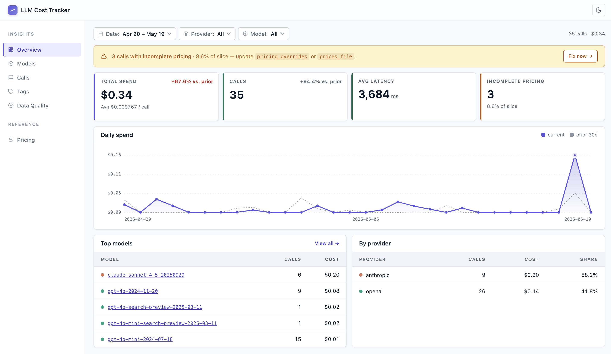

# LLM Cost Tracker

Per-tenant LLM spend attribution and budgets for Rails — in your database, no proxy.

[](https://rubygems.org/gems/llm_cost_tracker) [](https://github.com/sergey-homenko/llm_cost_tracker/actions) [](https://codecov.io/gh/sergey-homenko/llm_cost_tracker)

Every call through RubyLLM, the official OpenAI and Anthropic SDKs, Gemini, or any OpenAI-compatible API is logged with tokens, cost, and your tags. Budgets can block a tenant's next call before it is sent.

RubyLLM 2.0 also writes usage and cost to `ruby_llm_usages`, but only for chats persisted with `acts_as_chat`; those rows carry no tags, and it has no spend budgets. This gem records every call from the clients above, tagged however you choose.

Not Langfuse, Helicone, or LiteLLM. No prompts, no traces, no replay. Spend attribution only.

Requires Ruby 3.3+, Rails 8.0+, PostgreSQL or MySQL.

<picture> <source media="(prefers-color-scheme: dark)" srcset="docs/dashboard-overview-dark.png">  </picture>

## Quickstart

Shown with RubyLLM; the flow is identical for the official OpenAI and Anthropic SDKs — swap the gem and the `instrument` name (see the [cookbook](docs/cookbook.md)).

```ruby
# Gemfile
gem "llm_cost_tracker"
gem "ruby_llm"
```

```bash
bin/rails llm_cost_tracker:setup
```

Runs the install generator, drops a price snapshot, migrates the database, and verifies via `llm_cost_tracker:doctor`. Then enable the integration in the generated `config/initializers/llm_cost_tracker.rb`:

```ruby
LlmCostTracker.configure do |config|
  config.tags.default = -> { { environment: Rails.env } }
  config.instrument :ruby_llm
end
```

Edit it in place to add tags, switch on async ingestion, etc.

Your RubyLLM calls stay unchanged — every chat, embedding, transcription, image, and moderation call now lands in the ledger. Tag them to attribute spend:

```ruby
LlmCostTracker.with_tags(user_id: Current.user&.id, feature: "chat") do
  RubyLLM.chat.ask("Hello")
end
```

Mount the dashboard in `config/routes.rb`, behind your auth:

```ruby
authenticate :admin do
  mount LlmCostTracker::Engine => "/llm-costs"
end
```

The engine ships without authentication on purpose.

## What lands in the ledger

- **Calls.** Provider, model, total tokens, total cost, latency, status.
- **Line items.** Per-component breakdown — text/audio/cached tokens, tool charges (web search, code execution, grounding, container sessions).
- **Tags.** Whatever attribution you pass — user, feature, tenant, env.
- **Provider IDs.** Response, project, API key, workspace — for downstream audits.
- **Pricing snapshot.** So historical numbers don't drift when prices change.

## Capture surfaces

| Surface | Path |
| --- | --- |
| RubyLLM | Provider layer |
| OpenAI | Official SDK or Faraday |
| Anthropic | Official SDK or Faraday |
| Azure OpenAI | Faraday or official SDK (auto-detected on `*.openai.azure.com` and Foundry `*.services.ai.azure.com`, both deployments and `/openai/v1/...`) |
| Google Gemini | Faraday |
| `ruby-openai` | Faraday |
| OpenRouter, DeepSeek, Groq, LiteLLM-style gateways | OpenAI-compatible Faraday |
| Anything else | `LlmCostTracker.track` |

Streams capture when the provider emits final usage. OpenAI Faraday streams to `/chat/completions` get `stream_options: { include_usage: true }` auto-injected so the final usage chunk lands in the ledger (opt out via `config.capture.request_stream_usage = false`).

Captured does not always mean priced:

| Cost comes from | Calls |
| --- | --- |
| Bundled [`prices.json`](lib/llm_cost_tracker/prices.json) | The OpenAI, Anthropic, Gemini, Groq, and OpenRouter models it lists |
| The OpenAI, Anthropic, or Gemini price for the same model name | Azure OpenAI (by the model in the response, not the deployment name), Vertex AI through RubyLLM, gateways that pass a listed model name through |
| Nothing: recorded with `cost_status: unknown` | DeepSeek, and through RubyLLM also xAI, Mistral, Perplexity, Ollama, and Bedrock |

Add missing prices to `config.pricing.file` or `config.pricing.overrides` ([Pricing](docs/pricing.md)), then run `bin/rails llm_cost_tracker:backfill_unknown_pricing` to price the calls already recorded.

## What it isn't

- No proxy. Direct calls only.
- No prompts. Token counts and metadata only.
- No traces, evals, or prompt management. Different product, different gem.
- Not multi-service. Built for a Rails monolith.

## Manual tracking

For batch jobs, internal gateways, or anything without an SDK/Faraday hook:

```ruby
LlmCostTracker.track(
  provider: :anthropic,
  model: "claude-sonnet-4-6",
  tokens: { input_tokens: 1500, output_tokens: 320 },
  tags: { feature: "summarizer", user_id: current_user.id }
)
```

## Docs

- [Configuration](docs/configuration.md)
- [Pricing](docs/pricing.md)
- [Budgets](docs/budgets.md)
- [Data model](docs/data-model.md)
- [Querying](docs/querying.md)
- [Dashboard](docs/dashboard.md)
- [Streaming](docs/streaming.md)
- [Cookbook](docs/cookbook.md)
- [Extending](docs/extending.md)
- [Operations](docs/operations.md)
- [Architecture](docs/architecture.md)
- [EU AI Act record-keeping](docs/eu_ai_act.md)
- [Upgrading](docs/upgrading.md)
- [Changelog](CHANGELOG.md)

## Development

```bash
bundle install
bin/check
```

## License

MIT — see [LICENSE.txt](LICENSE.txt).
