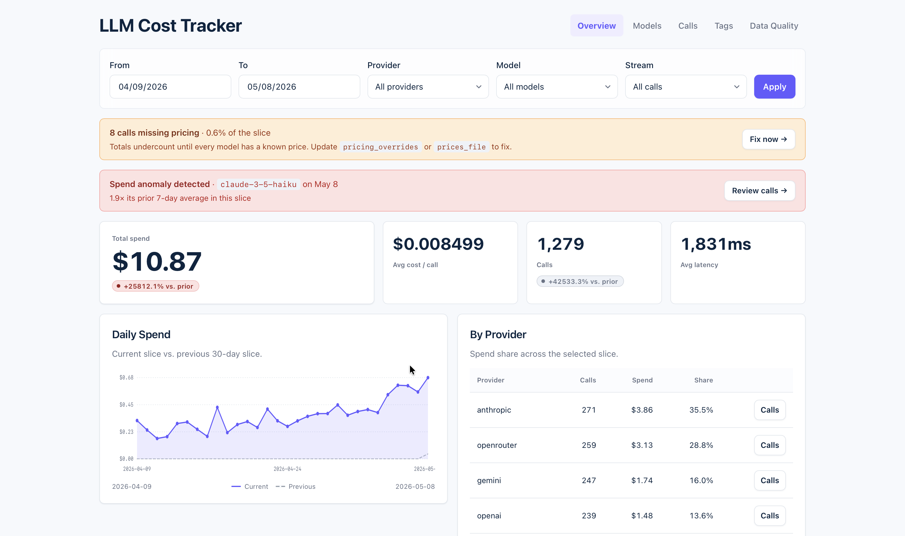

# LLM Cost Tracker

A Rails-native ledger and budget guardrail for LLM API spend.

[](https://rubygems.org/gems/llm_cost_tracker)
[](https://github.com/sergey-homenko/llm_cost_tracker/actions)
[](https://codecov.io/gh/sergey-homenko/llm_cost_tracker)

LLM Cost Tracker records provider-reported usage in the host Rails database,
prices it locally, enforces spend guardrails, and exposes a mountable dashboard.
Calls still go directly to providers; no proxy or external service is required.

It is not Langfuse, Helicone, or LiteLLM. It does not capture prompts, score
completions, or replay traces. It records spend by provider, model, and feature.

Requires Ruby 3.4+, Rails 7.1+, PostgreSQL or MySQL, and Faraday 2.0+.



## Quickstart

Add the gem alongside your LLM client:

```ruby
gem "llm_cost_tracker"
gem "openai"
```

Install, migrate, and verify:

```bash
bin/rails llm_cost_tracker:setup
```

This runs the install generator with the dashboard and local pricing file,
migrates the database, then runs `llm_cost_tracker:doctor`.

Configure capture:

```ruby
LlmCostTracker.configure do |config|
  config.default_tags = -> { { environment: Rails.env } }
  config.instrument :openai
end
```

Attribute calls with tags — they answer "who burned this money":

```ruby
LlmCostTracker.with_tags(user_id: Current.user&.id, feature: "chat") do
  client = OpenAI::Client.new(api_key: ENV["OPENAI_API_KEY"])
  client.responses.create(model: "gpt-4o", input: "Hello")
end
```

Visit `/llm-costs` for the dashboard. Mount it behind your app's auth before
deploying; the gem does not ship with authentication.

## What You Get

- Local ActiveRecord ledger of calls, tokens, costs, latency, tags, response IDs,
  provider grouping dimensions, usage source, cost status, pricing snapshot,
  and provider-reported service charge rows.
- Auto-capture for RubyLLM and the official `openai` and `anthropic` Ruby SDKs.
- Faraday middleware for `ruby-openai`, Gemini REST, OpenAI-compatible gateways,
  and custom clients that expose Faraday.
- Server-rendered dashboard with overview, models, calls, tags, CSV export, and
  data-quality pages.
- Local price snapshots refreshed from maintained provider pricing scrapers.
- Monthly, daily, and per-call budget guardrails.

## Deliberate Non-Goals

- No proxy. Calls go app -> provider directly.
- No prompts or completions stored. Token counts and metadata only.
- Not invoice-grade. `provider_response_id` is stored for downstream reconciliation.
- No bundled auth on the dashboard. Mount behind your app's auth.
- Not a multi-service aggregator. Built for a Rails monolith, not a polyglot platform.

## Capture Surfaces

| Surface | Capture path |
| --- | --- |
| OpenAI | Official SDK or Faraday |
| Anthropic | Official SDK or Faraday |
| Google Gemini | Faraday |
| RubyLLM | RubyLLM provider layer |
| `ruby-openai` (community gem) | Faraday |
| OpenRouter, DeepSeek, Groq, LiteLLM-style gateways | OpenAI-compatible Faraday |
| Other clients | Explicit `LlmCostTracker.track` / `track_stream` |

Streaming is captured when the provider emits final usage. OpenAI Faraday
streams need `stream_options: { include_usage: true }`. OpenAI Realtime
WebSocket/WebRTC sessions use explicit stream capture.

## Accuracy Model

LLM Cost Tracker estimates spend from provider-reported usage and configured
prices. It is useful for explaining spend by provider, model, feature, user, or
tenant. It is not invoice-grade billing: enterprise rates, unsupported billing
dimensions, account-level free tiers, and provider reconciliation are handled
outside the local ledger.

Provider response IDs, capture-time provider dimensions, pricing snapshots,
cost status, and service charge rows are stored so downstream audits can join
local records back to provider data.

## Explicit Tracking

For internal gateways, batch jobs, or clients without an SDK/Faraday hook:

```ruby
LlmCostTracker.track(
  provider: :anthropic,
  model: "claude-sonnet-4-6",
  tokens: { input: 1500, output: 320 },
  provider_project_id: "proj_123",
  batch: true,
  tags: { feature: "summarizer", user_id: current_user.id }
)
```

## Documentation

Already using the gem:

- [Upgrading](docs/upgrading.md)
- [Changelog](CHANGELOG.md)

Reference:

- [Configuration](docs/configuration.md)
- [Pricing and price refresh](docs/pricing.md)
- [Budgets and guardrails](docs/budgets.md)
- [Data model](docs/data-model.md)
- [Querying and reports](docs/querying.md)
- [Dashboard mounting](docs/dashboard.md)
- [Streaming capture](docs/streaming.md)
- [Cookbook](docs/cookbook.md)
- [Extending](docs/extending.md)
- [Production operations](docs/operations.md)
- [Architecture](docs/architecture.md)

## Development

```bash
bundle install
bin/check
```

Architecture rules and contribution conventions live in
[docs/architecture.md](docs/architecture.md).

## License

MIT - see [LICENSE.txt](LICENSE.txt).
