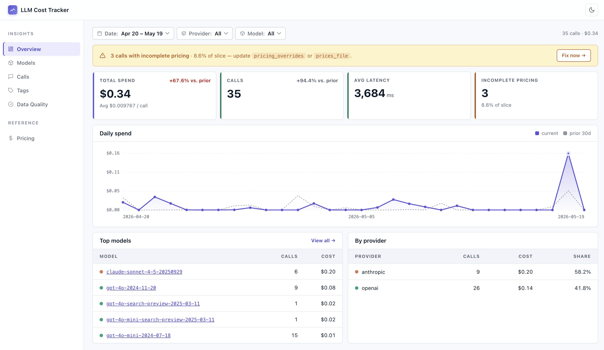

# LLM Cost Tracker

LLM spend tracking and budgets for Rails — by user, feature, or any tag, in your own database, no proxy.

[](https://rubygems.org/gems/llm_cost_tracker) [](https://github.com/sergey-homenko/llm_cost_tracker/actions) [](https://codecov.io/gh/sergey-homenko/llm_cost_tracker)

Not Langfuse, Helicone, or LiteLLM. No prompts, no traces, no replay. Spend attribution only.

Requires Ruby 3.3+, Rails 8.0+, PostgreSQL or MySQL. Built for a Rails monolith, not multiple services.

<picture> <source media="(prefers-color-scheme: dark)" srcset="docs/dashboard-overview-dark.png">  </picture>

## Quickstart

Shown with RubyLLM; the flow is identical for the official OpenAI and Anthropic SDKs — swap the gem and the `instrument` name (see the [cookbook](docs/cookbook.md)).

```ruby
# Gemfile
gem "llm_cost_tracker"
gem "ruby_llm"
```

```bash
bin/rails llm_cost_tracker:setup
```

Runs the install generator, drops a price snapshot, migrates the database, and verifies via `llm_cost_tracker:doctor`. Then enable the integration in the generated `config/initializers/llm_cost_tracker.rb`:

```ruby
LlmCostTracker.configure do |config|
  config.tags.default = -> { { environment: Rails.env } }
  config.instrument :ruby_llm
end
```

Your RubyLLM calls stay unchanged — every chat, embedding, transcription, image, and moderation call now lands in the ledger. Tag them to attribute spend:

```ruby
LlmCostTracker.with_tags(user_id: Current.user&.id, feature: "chat") do
  RubyLLM.chat.ask("Hello")
end
```

Mount the dashboard in `config/routes.rb`. The engine ships without authentication, so put it behind yours:

```ruby
authenticate :admin do
  mount LlmCostTracker::Engine => "/llm-costs"
end
```

## What it records

- **Calls.** Provider, model, total tokens, total cost, latency, status.
- **Line items.** Per-component breakdown — text/audio/cached tokens, tool charges (web search, grounding, container sessions).
- **Tags.** Whatever attribution you pass — user, feature, tenant, env.
- **Provider IDs.** Response, project, API key, workspace — for downstream audits.
- **Pricing snapshot.** So historical numbers don't drift when prices change.

## Budgets

Daily, monthly, and per-call limits, plus per-tag limits such as one monthly budget per `tenant_id`. A crossed limit calls your `on_exceeded` hook, raises, or blocks the next call before it is sent. See [Budgets](docs/budgets.md).

## Supported clients

| Client | Captured through |
| --- | --- |
| RubyLLM | Instrumentation events (2.x) or the provider layer (1.x) |
| OpenAI, Anthropic | Official SDK or Faraday |
| Azure OpenAI | Official SDK or Faraday, on `*.openai.azure.com` and Foundry `*.services.ai.azure.com` |
| Google Gemini, `ruby-openai` | Faraday |
| OpenRouter, DeepSeek, Groq, xAI, Mistral, Perplexity | Faraday, or the official OpenAI SDK with `base_url` on that host |
| Other OpenAI-compatible gateways | The same, once the host is added to `config.capture.openai_compatible_providers` |
| Anything else | [`LlmCostTracker.track`](#manual-tracking) |

Streams are recorded from the provider's final usage; see [Streaming](docs/streaming.md).

## Pricing

Captured does not always mean priced:

| Cost comes from | Calls |
| --- | --- |
| The billed amount in the response or final stream chunk: `usage.cost`, xAI's `usage.cost_in_usd_ticks`, or Perplexity's `usage.cost.total_cost` | OpenRouter, xAI, Perplexity, and other OpenAI-compatible gateways that return one (through RubyLLM 1.x, OpenRouter chats only) |
| Bundled [`prices.json`](lib/llm_cost_tracker/prices.json) | The OpenAI, Anthropic, Gemini, Groq, OpenRouter, xAI, and Mistral models it lists, and the same Claude models on Bedrock through RubyLLM |
| The OpenAI, Anthropic, or Gemini price for the same model name | Azure OpenAI (by the model in the response, not the deployment name), Vertex AI through RubyLLM, gateways that pass a listed model name through |
| Nothing: recorded with `cost_status: unknown` | DeepSeek, Perplexity without a billed amount (its Router, and anything through RubyLLM 1.x), and through RubyLLM also Ollama, other Bedrock models, and Claude on GovCloud (`us-gov.` profiles) |

Add missing prices to `config.pricing.file` or `config.pricing.overrides` ([Pricing](docs/pricing.md)), then run `bin/rails llm_cost_tracker:backfill_unknown_pricing` to price the calls already recorded.

## Manual tracking

For batch jobs, internal gateways, or anything without an SDK or Faraday hook:

```ruby
LlmCostTracker.track(
  provider: :anthropic,
  model: "claude-sonnet-4-6",
  tokens: { input_tokens: 1500, output_tokens: 320 },
  tags: { feature: "summarizer", user_id: current_user.id }
)
```

## Docs

- [Configuration](docs/configuration.md)
- [Pricing](docs/pricing.md)
- [Budgets](docs/budgets.md)
- [Data model](docs/data-model.md)
- [Querying](docs/querying.md)
- [Dashboard](docs/dashboard.md)
- [Streaming](docs/streaming.md)
- [Cookbook](docs/cookbook.md)
- [Extending](docs/extending.md)
- [Operations](docs/operations.md)
- [Architecture](docs/architecture.md)
- [EU AI Act record-keeping](docs/eu_ai_act.md)
- [Upgrading](docs/upgrading.md)
- [Changelog](CHANGELOG.md)

## Development

```bash
bundle install
bin/check
```

## License

MIT — see [LICENSE.txt](LICENSE.txt).
